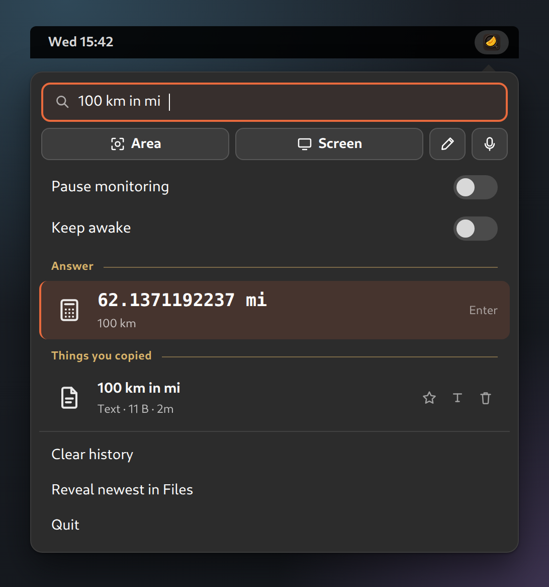
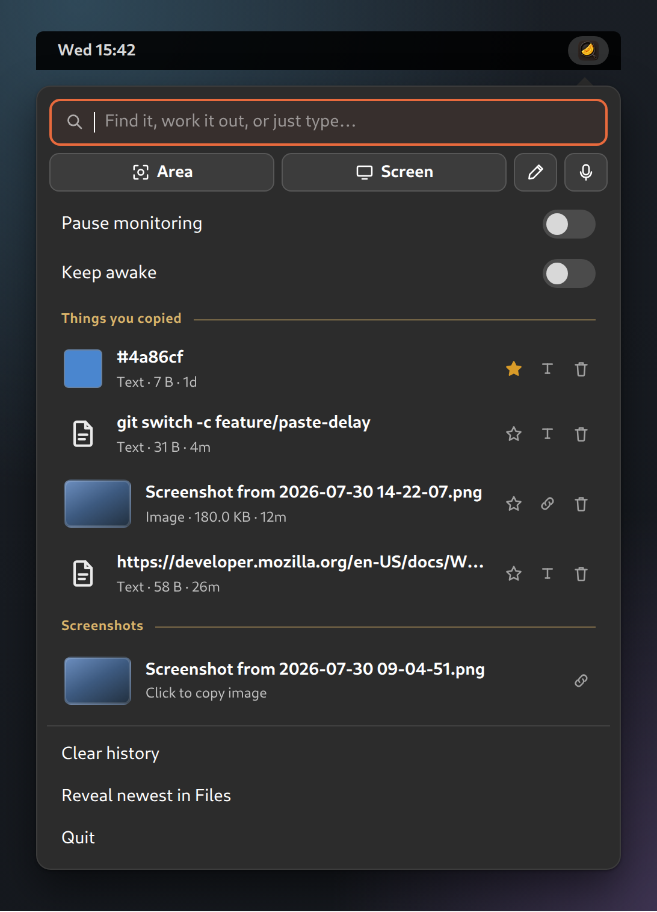
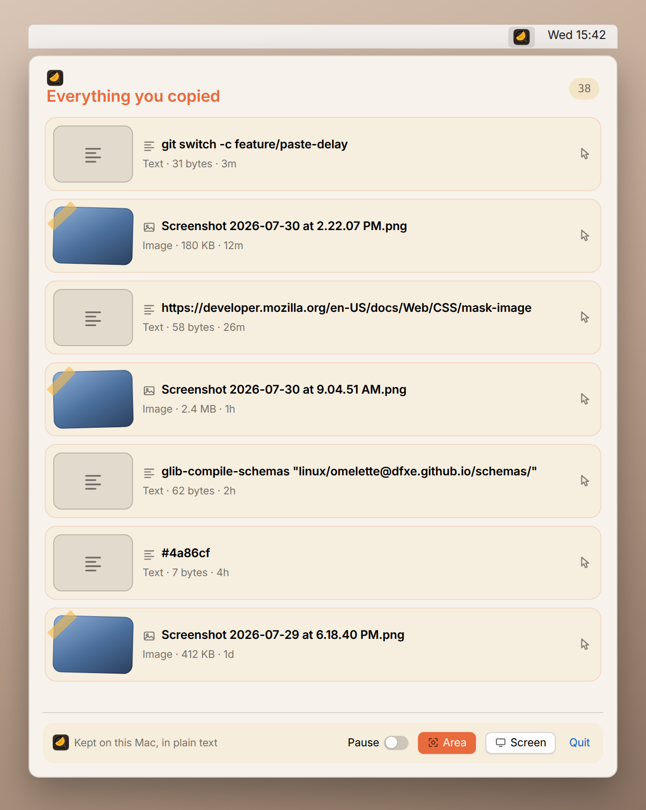

# 📋 Omelette

**Everything you copy, within reach.** A clipboard and screenshot history in
your top bar, for macOS and GNOME.


[](https://dfxe.github.io/omelette)

Your clipboard remembers one thing. Omelette remembers the last few hundred,
keeps your recent screenshots beside them, and gives any of it back with a
click. On GNOME the same search box also does snippets, a calculator,
quicklinks and emoji, with optional private local voice dictation.

Everything stays on your machine. No accounts, no sync. Currency conversion is
off by default; Voce only uses the network when you explicitly download a
speech model.

```
macos/    Swift + SwiftUI MenuBarExtra app   (macOS 13+, no Xcode project)
linux/    GNOME Shell extension, GJS / ESM   (GNOME 45–49, no build step)
voce/     Optional Whisper dictation backend (GNOME/Wayland, GPL-3.0+)
```

## 📸 What it looks like

| GNOME — the command bar | GNOME — history and screenshots |
| ----------------------- | ------------------------------- |
|  |  |



> **Rendered mockups with sample data, not live captures.** Layout, strings and
> number formatting come from the source; the contents are invented. Built from
> `docs/mocks/` by `docs/build.mjs` — see [The website](#the-website).

## ✨ At a glance

The two platforms share a design, not a codebase. GNOME is the more complete
implementation today.

|                                        | macOS | GNOME |
| -------------------------------------- | :---: | :---: |
| Clipboard history (text + images)      |   ✅   |   ✅   |
| Screenshot capture (area / screen)     |   ✅   |   ✅   |
| Screen color picker (hex)              |   —   |   ✅   |
| Image annotation · arrows · boxes · text |  —   |   ✅   |
| Keep awake (blocks sleep and blanking)  |   —   |   ✅   |
| Local voice dictation (optional Voce)   |   —   |   ✅   |
| Search · pin · delete                  |   —   |   ✅   |
| Pause (incognito)                      |   ✅   |   ✅   |
| Ranked command bar + keyboard nav      |   —   |   ✅   |
| Snippets with placeholders             |   —   |   ✅   |
| Calculator · units · dates             |   —   |   ✅   |
| Quicklinks + web search                |   —   |   ✅   |
| Emoji & symbol picker                  |   —   |   ✅   |
| Currency conversion (opt-in, network)  |   —   |   ✅   |
| Bluetooth battery gauges · fan speeds  |   —   |   ✅   |
| PDF page extraction (needs poppler)    |   —   |   ✅   |
| Auto-expiry, size caps, settings UI    |   —   |   ✅   |
| Configurable shortcuts                 |   —   |   ✅   |
| Password-manager filtering             |   ✅   |   ✅   |
| Paste injection                        |   ✅   |   ✅   |
| Clipboard auto-clear                   |   ✅   |   —   |
| Encrypted at rest                      |   —   |   —   |

## 📦 How to install

Both platforms build from this repo; there are no releases to download.

**macOS** — needs the Xcode command-line tools (`xcode-select --install`). No
third-party dependencies.

```sh
cd macos
./build.sh
open build/Omelette.app
```

A vault icon appears in the menu bar. For `⌘V` to paste from the vault, grant
**Accessibility** under System Settings → Privacy & Security.

**GNOME** — no build step, but `glib-compile-schemas` (from `libglib2.0-bin`) must
compile the bundled GSettings schema once, and again whenever it changes.

```sh
glib-compile-schemas "linux/omelette@dfxe.github.io/schemas/"
mkdir -p ~/.local/share/gnome-shell/extensions
ln -s "$PWD/linux/omelette@dfxe.github.io" ~/.local/share/gnome-shell/extensions/
# X11: Alt+F2 → r → Enter.   Wayland: log out and back in.
gnome-extensions enable omelette@dfxe.github.io
```

A clipboard icon appears in the top panel. If it doesn't,
`gnome-extensions info omelette@dfxe.github.io` reports the state and the error.
The optional `linux/org.dfxe.Omelette.desktop` launcher opens preferences and
can be installed with its icon under `~/.local/share/applications` and
`~/.local/share/icons/hicolor` to expose Omelette in the app
drawer.

For private local dictation, build the optional Voce backend after installing
its Ubuntu dependencies:

```sh
cd voce
make check test build
make runtime
make install-user
systemctl --user enable --now voce.service
```

Open `voce` once to download a Whisper model. Dictation then lives in the
Omelette menu: hold `Super+Alt+Space`, or toggle with `Super+Alt+D`.

## 🍎 macOS

A vault icon appears in the menu bar; no Dock icon (`LSUIElement`). Copy as usual
and it lands in the popover; click a row to select it for the next paste.

| Shortcut                | Does                                                      |
| ----------------------- | --------------------------------------------------------- |
| `⌘V`                    | Pastes the selected vault item (newest, if none selected)  |
| `⌃⌥S`                   | Capture an area into the vault                             |
| `⇧⌘3` / `⇧⌘4` / `⇧⌘5`   | Capture — **replaces** the native macOS screenshot UI      |

None of these are configurable.

> ⚠️ **The native screenshot shortcuts are swallowed, not shared.** While
> Omelette runs, `⇧⌘3`/`⇧⌘4`/`⇧⌘5` never reach macOS, including the `⇧⌘5`
> toolbar. Quit to get them back.

`⌘V` is intercepted globally: the app swallows the keystroke, puts the selected
item on the pasteboard just in time, synthesizes a paste, then wipes it ~350 ms
later — so the pasteboard sits empty and every paste routes through the vault.
Needs **Accessibility** permission; without it `⌘V` behaves normally. Screenshots
go into the app's own storage, and it never scans `$HOME`.

### Current limits

The popover has a Pause toggle, Area, Screen, About and Quit, and nothing else.

- No per-item delete, no clear-history, no pin, no search.
- History capped at 200 entries, oldest dropped. Not configurable.
- Images are base64-inline in `vault.json` with no size cap, so a history of
  Retina screenshots gets very large.
- To wipe: quit, then
  `rm ~/Library/Application\ Support/omelette/vault.json`.

## 🐧 GNOME

A clipboard icon appears in the top panel. Copy text or an image and it shows up
under **Things you copied**; `PrtScn` shots show under **Screenshots**.

### The command bar

The box at the top searches everything at once and ranks the results, each source
under its own heading, focused the moment the popup opens.

| Key | Does |
| --- | --- |
| `↑` `↓` | Move through results, across section boundaries |
| `Page Up` / `Page Down` | Jump eight rows |
| `Enter` | Activate the selected row |
| `Esc` | Clears the query, then leaves a tool, then closes the popup |

Sections are ordered **Answer**, **Quicklinks**, **Snippets**, **Emoji &
symbols**, **System**, **Keep awake**, **PDF**, **Edit an image**, **Things you
copied**, **Screenshots** — each capped, and
hidden when nothing matches. Ranking is shared by every source: exact beats prefix beats word
boundary beats substring beats loose subsequence (`bgcol` finds
`background-color`), and shorter matches win ties.

Activating a row copies it **and** sends `Ctrl+V` to the window that had focus
(`Ctrl+Shift+V` in terminals). If a paste lands somewhere unexpected, raise
**Paste delay**.

### Tools

- **Answer** — arithmetic (`2+2*8`), units (`100 km in mi`), percentages
  (`20% of 300`) and dates (`today + 30 days`), all kept in history. The parser
  is hand-written with no `eval()`: this runs inside the compositor process.
- **Snippets** — searched by keyword, label or body, with `{date}`, `{time}`,
  `{clipboard}`, `{uuid}` and `{cursor}` placeholders (`{date:%d %b %Y}` takes
  any `strftime` format). Every text row has a **Save as snippet** button.
- **Quicklinks** — `gh omelette` opens a GitHub search; typing `github`
  finds it by name. Nine are set up on first run and stay deleted if you delete
  them; a **Search the web for…** row catches the rest.
- **Emoji & symbols** — recently-used first, plus arrows, maths, Greek, currency
  and the invisible characters. No data is bundled: it reads the set GNOME Shell
  already ships.
- **Currency** — `100 usd in eur`, **off by default**. See
  [Currency and the network](#currency-and-the-network).
- **System** — `bt` shows every connected Bluetooth device that reports a
  battery, each as a circular gauge; `fan` shows fan speeds in RPM if this
  machine has sensors. Devices also answer to their own name, so `master` finds
  the mouse. Its shortcut opens straight into a dashboard of all the gauges at
  once. Both readings are local — BlueZ over the system bus and
  `/sys/class/hwmon` — and neither needs root.
- **PDF** — type `pdf` to open a panel with a **Choose a PDF…** button, a page
  box and **Extract**. `7` pulls one page, `3-7` pulls five; the result is a
  single PDF in a new folder next to the original, so `~/Documents/report.pdf`
  gives `~/Documents/report-extracted/report-p3-7.pdf`. Nothing is ever
  overwritten — a second run of the same range writes `… (2).pdf`. Needs
  **poppler-utils**; without it the section says so instead of offering a
  button that cannot work.
- **Edit** — opens a screenshot or a copied image in **omelette-edit**, a small
  GTK4 window for drawing arrows, boxes and text in any of eight colours, plus
  an eyedropper that reads a colour straight off the image and copies the hex.
  The edit button appears on every image row; `edit` in the command bar lists
  the recent shots and offers a file chooser. See
  [The image editor](#the-image-editor).
- **Keep awake** — stops the screen blanking and the machine suspending, either
  until you switch it off or for 15 minutes, an hour or two hours. Typing
  `caffeine`, `coffee` or `insomnia` finds it too. There is also a switch in the
  popup, and the panel icon takes on a colour while it is holding.

### The rest

- **History** — text and PNGs, deduplicated, newest first (200 by default). Every
  row has **pin** (exempt from the cap and from expiry) and **delete**.
- **Pause** — incognito toggle. Password-manager-flagged content is skipped
  either way.
- **Screenshots** — the 10 newest PNGs in `~/Pictures/Screenshots`.
- **Capture** — **Area** and **Screen** via GNOME's own screenshot service.
- **Color** — an eyedropper with a live `#RRGGBB` readout. Hex entries show in
  the list as a colour swatch.
- **About** — type `about` (or `version`) for the version, licence and a link to
  the project; `prefs` opens the preferences window without a terminal. Both only
  answer to their own names, so they never turn up in an ordinary search.
- **Quit** — turns the extension off from the popup; it stays off across a reboot.

Clicking an image row puts real PNG bytes on the clipboard, which GUI apps paste
directly. Terminals shell out to a helper, so `Ctrl+V` there needs `xclip` (X11)
or `wl-clipboard` (Wayland). Every image row also has a **link** button that
copies the *path* instead — no helper needed, and it works over SSH.

The PDF tool is the one other feature with an external prerequisite:
`poppler-utils`, for `pdfinfo`, `pdfseparate` and `pdfunite`
(`sudo apt install poppler-utils`). It is the only thing here that runs a
subprocess, and it does so with argv arrays rather than a shell, so a path with
spaces or quotes in it needs no escaping.

### The image editor

`omelette-edit` is a separate GTK4 window, not part of the popup. A drawing
canvas inside gnome-shell would put hit-testing and an undo stack in the
compositor process, where a mistake does not throw an exception — it freezes the
desktop. It also means the editor runs straight from a terminal, with a real
stack trace on stderr:

```sh
gjs -m ~/.local/share/gnome-shell/extensions/omelette@dfxe.github.io/editor/main.js shot.png
```

Four tools — arrow, box, text, eyedropper — three stroke widths, eight colours
plus a colour picker, and undo/redo. Colour is a property of each shape, so
changing it never restyles what is already drawn. Text is typed into a popover
where you clicked and gets a contrasting halo, so white on a red button is still
readable.

**It never overwrites anything.** Save always writes a new file — `shot.png`
becomes `shot (edited).png`, then `shot (edited) (2).png` — and an edit of a
*copied* image is written to the screenshots folder rather than back into
`~/.local/share/omelette/images/`. That directory is content-addressed: the
filenames are hashes of the bytes, and the vault skips writing a file it already
has, so editing one in place would permanently replace the original and a new
file dropped in beside it would be garbage-collected.

**Copy** hands the PNG back to the extension rather than taking the clipboard
itself. On X11 clipboard ownership belongs to a process, so closing the editor
would empty it — GNOME ships no clipboard manager to hold the bytes. gnome-shell
does not exit, so it owns the write, over a one-line-per-event protocol on the
editor's stdout.

It needs `gjs`, which is a *different package* from the library gnome-shell
itself uses — the Shell links `libgjs`, so the interpreter may not be installed
(`sudo apt install gjs`). Without it the section says so rather than offering a
button that cannot work, exactly as the PDF tool does for poppler.

Under Wayland the window falls back to a generic icon in the overview and
alt-tab, because GNOME matches windows to an installed `.desktop` file by
application ID and there is no install step to put one there.

### Keeping the machine awake

**Keep awake** holds an inhibitor against `org.gnome.SessionManager` for both
suspend *and* idle. Either alone is not enough: idle-only still lets the machine
suspend on the power setting, and suspend-only still lets the screen blank and
lock underneath you.

The deadline is stored as an absolute time, not a countdown, because a countdown
cannot survive the things that routinely interrupt one — locking the screen
disables the extension and stops its timers, and timers do not advance across a
suspend. A wall-clock deadline is still correct after either.

**Locking the screen ends it.** GNOME disables extensions on the lock screen
unless they declare `session-modes`, and declaring it would keep clipboard
monitoring running while the session is locked — a worse trade than losing the
inhibitor. Unlocking re-acquires it if the deadline has not passed.

If you are checking whether it is really holding, look for the inhibitor by name
rather than asking whether the session is inhibited at all:

```sh
gdbus call --session --dest org.gnome.SessionManager \
  --object-path /org/gnome/SessionManager \
  --method org.gnome.SessionManager.GetInhibitors
```

`IsInhibited` ORs across every client on the session and reads `true` on an
ordinary desktop anyway, because a browser playing a video is already holding
one.

### Upgrading from clipboard-box or cBoite

The project was called `clipboard-box`, then `cBoite`, before it was Omelette.
Each rename moved the extension UUID, the GSettings schema and the data
directory.

History, images and cached rates migrate themselves the first time the new build
runs — `dataDir.js` walks the chain newest-first and renames whichever old
directory it finds into place, so either starting point works and you can skip a
name entirely.

Settings are the exception. Snippets and quicklinks live in dconf under the old
schema path, and reading them in code would mean shipping the old schema purely
so `Gio.Settings` could construct. One line instead — run it **before** removing
the old extension, and use whichever name you are coming from:

```sh
# from cBoite
dconf dump /org/gnome/shell/extensions/cboite/ \
  | dconf load /org/gnome/shell/extensions/omelette/
gnome-extensions disable cboite@dfxe.github.io
rm ~/.local/share/gnome-shell/extensions/cboite@dfxe.github.io

# from clipboard-box, if you never ran a cBoite build
dconf dump /org/gnome/shell/extensions/clipboard-box/ \
  | dconf load /org/gnome/shell/extensions/omelette/
gnome-extensions disable clipboard-box@dfxe.github.io
rm ~/.local/share/gnome-shell/extensions/clipboard-box@dfxe.github.io
```

### Preferences

```sh
gnome-extensions prefs omelette@dfxe.github.io
```

Or type `prefs` in the command bar, which opens the same window.

Four pages: **General**, **Tools**, **Snippets** and **Quicklinks**. Edits reach
the popup immediately, without a shell restart.

| Setting                     | Default                  | Effect                                             |
| --------------------------- | ------------------------ | -------------------------------------------------- |
| Maximum entries             | 200                      | Oldest unpinned dropped first                       |
| Auto-expire after (days)    | 0 — never                | Unpinned entries only                               |
| Store copied images         | on                       | Off = text only; Area/Screen captures still stored  |
| Max copied-image size       | 10 MB                    | 0 = unlimited; captures are exempt                  |
| Screenshots folder          | `~/Pictures/Screenshots` | Watched *and* captured into                         |
| Pause monitoring            | off                      | Incognito                                           |
| Encrypt history at rest     | off                      | **Not implemented** — inert placeholder             |
| Paste after copying         | **on**                   | Sends `Ctrl+V` to the focused window                |
| Use Ctrl+Shift+V in terminals | on                     | Matched on window class                             |
| Paste delay                 | 120 ms                   | Raise if pastes land in the wrong place             |
| Fallback search URL         | DuckDuckGo               | Used by the "Search the web for…" result            |
| Convert currencies          | **off**                  | The only setting that enables a network request     |
| Exchange rate endpoint      | frankfurter.app          | ECB daily rates, no API key                         |
| Show device batteries and fan speeds | on              | Read locally; nothing leaves the machine            |
| Fan reading interval        | 2 s                      | Only while the popup is open; batteries aren't polled |
| Open the editor after a capture | **off**              | The capture still lands in history and on the clipboard |
| Keep awake                  | off                      | Blocks blanking and suspend; ends when the screen locks |

Shortcuts take a raw accelerator string such as `<Super><Shift>V`.
Dictation defaults to `Super+Alt+Space` (hold) and `Super+Alt+D` (toggle);
the rest are unbound by default: **Open clipboard menu**, **Capture area**, **Capture
screen**, **Pick color**, **Open snippets**, **Open emoji picker**, **Open
system readings**, **Extract PDF pages**, **Keep awake**, **Edit newest
screenshot**, **Hold to dictate**, **Toggle dictation**. **Open snippets**
through **Extract PDF pages** open the popup
scoped to that one tool; the last two act immediately without opening it.

### Currency and the network

The only built-in feature that makes a network request, and **off by default** — with it
off nothing is ever fetched. With it on, rates come from `api.frankfurter.app`
(ECB daily reference rates, no API key, configurable endpoint), fetched only when
you type a conversion and at most once every 12 hours, then cached to
`~/.local/share/omelette/rates.json` so offline you get the cached rates
with their age shown. Only the currency codes are implied by the request.

## 🔒 Storage & privacy

Everything else in the core suite is local. Optional Voce separately downloads
the speech model you choose; transcription is offline after that.

|                     | macOS                                                       | GNOME                                        |
| ------------------- | ----------------------------------------------------------- | -------------------------------------------- |
| History             | `~/Library/Application Support/omelette/vault.json`     | `~/.local/share/omelette/vault.json`     |
| Images              | inline, base64 in `vault.json`                               | `~/.local/share/omelette/images/*.png`   |
| Screenshots         | `~/Library/Application Support/omelette/synced-screenshots/` | `~/Pictures/Screenshots/`               |
| Edited images       | —                                                            | beside the original, or `~/Pictures/Screenshots/` |
| Snippets, quicklinks | —                                                          | GSettings (`dconf`), as JSON strings          |
| Cached rates        | —                                                            | `~/.local/share/omelette/rates.json`     |
| File perms          | `0600`                                                       | `0600` / `0700`                               |

Snippets live in GSettings so an edit in the preferences window — a separate
process — reaches the popup straight away, but `dconf` is **not** `0600`-protected
the way `vault.json` is.

**Neither platform encrypts at rest.** `VaultCrypto.swift` holds a complete
scheme (Curve25519 ECDH → HKDF-SHA256 → AES-GCM, keys in the Keychain) but
**nothing calls it yet**, and GNOME's **Encrypt history at rest** toggle is
likewise inert. Don't copy secrets you wouldn't want written to disk. Both
platforms skip content a password manager has flagged
(`org.nspasteboard.ConcealedType` and friends on macOS, `passwordmanagerhint` and
friends on GNOME), but an app that sets none of them is indistinguishable from
any other — and macOS also stores unrecognised pasteboard flavors, so it captures
more than GNOME.

**An unreadable history file is moved aside, never overwritten** — renamed to
`vault.corrupt-<timestamp>.json`, and the app starts empty.

## 🛠 Development

```sh
linux/tests/run.sh          # unit tests
linux/tests/parse-check.sh  # syntax-check every module
```

No dependencies and no build step: the tested modules import nothing from
`resource:///`, so they load in plain `gjs` with no Shell and no display. That
covers `match`, `calc`, `units`, `format`, `configStore`, `searchRegistry`,
`sensors`, `vaultStore`, `pdfExtract`, `pdfProvider`, `awake`, `awakeProvider`
and the editor's `shapes`, `palette` and `exportImage`; everything else imports
`St`/`Clutter` and needs a real shell, so `parse-check.sh` at least
syntax-checks those.

Four invariants that are easy to break by accident:

- **Every clipboard write goes through `clipboardUtil.ingestText()`** — vault
  first so it owns the fingerprint, tell the monitor to ignore it, *then* write.
  Wrong order and our own writes return as new history entries.
- **The monitor's ignore set is consuming.** `.has()` instead of `.delete()`
  silently drops a later manual copy of the same text.
- **Nothing runs on the compositor thread that doesn't have to** — providers
  score pre-normalized text, and vault writes are coalesced and async, which is
  why `disable()` must call `vault.flush()`.
- **Rebuilds are suspended while a row is activating**, or the rebuild destroys
  the row that is about to show its ✓.

Adding a tool means writing a `{id, title, cap, search(query, ctx)}` provider and
appending it to `PROVIDERS`; providers are pure, synchronous and never touch
`St`. Extension JS changes need a **full gnome-shell restart**, not
disable/enable — X11 `Alt+F2` → `r`, Wayland log out or
`dbus-run-session -- gnome-shell --nested --wayland`. Changes under `schemas/`
need `glib-compile-schemas schemas/` first, or `enable()` throws. Anything
holding a resource must be cleared at the top of **both** `enable()` and
`disable()`, or a modal grab outlives the extension and the session stops
responding to clicks.

### The website

[dfxe.github.io/omelette](https://dfxe.github.io/omelette) is a concise project page, built from this file: `docs/build.mjs` lifts the tagline and lede into `docs/index.template.html`; the README holds the full documentation. A push to `main` redeploys it.

```sh
npm ci --prefix docs
npx --prefix docs playwright install chromium
node docs/build.mjs      # renders docs/shots/*.png, then docs/_site/
```

`docs/_site/` is the published output and is gitignored; `docs/shots/` is not,
because the screenshots above point at it. CI runs `node docs/build.mjs --check`,
which hashes `docs/mocks/` against `docs/shots/manifest.json` — **edit a mock,
rebuild, commit the PNGs** or the README keeps showing the old UI.

## License

MIT — see [LICENSE](LICENSE).
